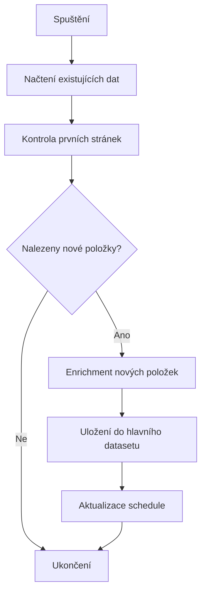

# 🚀 Inteligentní CSFD Scraper - Průvodce

## Přehled

**Hlavní systém** pro automatické přidávání nových filmů/seriálů do CSFD datasetu. Systém používá inteligentní inkrementální updates - místo scrapování všeho znovu, detekuje pouze nové položky a přidává je do datasetu. Optimalizován pro rychlé denní kontroly a automatické přizpůsobování frekvence podle aktivity.

## 🎯 Hlavní výhody

- **Rychlost**: Kontrola nových položek trvá 2-5 minut místo 3+ hodin
- **Inteligence**: Automatické přizpůsobování frekvence kontrol
- **Efektivita**: Enrichment pouze pro nové položky
- **Spolehlivost**: Automatické zálohování a error handling

## 📁 Struktura souborů

```
csfd-chatgpt/
├── incremental_scraper.mjs     # Hlavní inkrementální scraper
├── scrape_csfd.mjs            # Plný scraper (pouze manuálně)
├── smart_scheduler.mjs         # Inteligentní scheduler
├── manage_scraper.mjs          # Správce a monitoring
├── .github/workflows/
│   └── daily.yml              # Denní workflow (inkrementální + manuální plný)
└── data/
    ├── csfd_ratings.json       # Hlavní dataset
    ├── new_items.json          # Nové položky z posledního běhu
    ├── incremental_state.json  # Stav posledního běhu
    └── schedule_config.json    # Konfigurace schedule
```

## 🛠️ Použití

### Základní příkazy

```bash
# Testování inkrementálního scraperu
npm run scrape-inc

# Správa a testování
npm run manage status
npm run manage test-inc
npm run manage stats

# Správa schedule
npm run schedule --update
```

### Detailní příkazy

```bash
# Zobrazení stavu
node manage_scraper.mjs status

# Testování
node manage_scraper.mjs test-inc
node manage_scraper.mjs test-full

# Statistiky
node manage_scraper.mjs stats

# Čištění
node manage_scraper.mjs cleanup
```

## ⚙️ Konfigurace

### Inkrementální scraper (`incremental_scraper.mjs`)

```javascript
const config = {
  settings: {
    maxPagesToCheck: 5,        // Kolik stránek zkontrolovat
    maxNewItems: 50,           // Max nových položek na běh
    enableEnrichment: true,    // Zda enrichovat nové položky
    createBackup: true,        // Vytvořit zálohu
    verbose: true,             // Detailní logování
  }
};
```

### Smart scheduler

Systém automaticky upravuje frekvenci podle aktivity:

- **0 nových položek**: Každý den v 2:00 UTC (3 stránky)
- **1-5 nových položek**: Každý den v 2:00 UTC (5 stránek)
- **6-20 nových položek**: 2x denně v 2:00 a 14:00 UTC (8 stránek)
- **20+ nových položek**: Každých 6 hodin (10 stránek)

## 🔄 Workflow

### 1. Inkrementální kontrola


### 2. Enrichment proces
- **IMDb ID**: Automatické vyhledání
- **Originální název**: Extrakce z CSFD
- **Žánr**: Získání z detailní stránky
- **Režisér**: Extrakce z creators sekce
- **Popis**: Zkrácený popis (max 200 znaků)

## 📊 Monitoring

### Stav souborů
- `data/csfd_ratings.json` - Hlavní dataset
- `data/new_items.json` - Nové položky z posledního běhu
- `data/incremental_state.json` - Stav a statistiky
- `data/schedule_config.json` - Aktuální konfigurace schedule

### GitHub Actions
- **Automatické spouštění**: Podle schedule
- **Manuální spuštění**: S možností výběru režimu
- **Commit změn**: Automatické commitování nových položek
- **Artifacts**: Uložení debug informací

## 🚨 Troubleshooting

### Časté problémy

1. **Žádné nové položky nenalezeny**
   ```bash
   node manage_scraper.mjs status
   # Zkontrolujte, zda existuje hlavní dataset
   ```

2. **Chyby při enrichment**
   ```bash
   node manage_scraper.mjs test-inc
   # Testujte s verbose výstupem
   ```

3. **Problémy se schedule**
   ```bash
   node smart_scheduler.mjs --update
   # Aktualizujte schedule konfiguraci
   ```

### Debug režim

```bash
# Spuštění s detailním logováním
node incremental_scraper.mjs --verbose

# Zobrazení posledních nových položek
node manage_scraper.mjs recent

# Čištění dočasných souborů
node manage_scraper.mjs cleanup
```

## 📈 Výkon

### Porovnání s původním systémem

| Metrika | Původní scraper | Inkrementální |
|---------|----------------|---------------|
| Čas běhu | 3+ hodiny | 2-5 minut |
| Zatížení | Vysoké | Nízké |
| Frekvence | Týdně | Denně/častěji |
| Nové položky | Všechny | Pouze nové |

### Optimalizace

- **Cache**: Opakované požadavky se cachují
- **Adaptivní delays**: Přizpůsobení podle response time
- **Chunked processing**: Zpracování po malých dávkách
- **Error recovery**: Automatické opakování při chybách

## 🔧 Rozšíření

### Přidání nových polí

1. Upravte `incremental_scraper.mjs` - přidejte extrakci
2. Aktualizujte `extractBasicDetails` funkci
3. Testujte s `npm run manage test-inc`

### Změna schedule logiky

1. Upravte `smart_scheduler.mjs`
2. Změňte `config.baseSchedule` hodnoty
3. Spusťte `npm run schedule --update`

## 📝 Poznámky

- Systém je navržen pro stabilní provoz
- Automatické zálohování před změnami
- Kompatibilní s existujícím workflow
- Možnost fallback na plný scraper

## 🆘 Podpora

Pro problémy nebo otázky:
1. Zkontrolujte logy: `node manage_scraper.mjs status`
2. Testujte: `node manage_scraper.mjs test-inc`
3. Zkontrolujte GitHub Actions artifacts
4. Vytvořte issue s logy a popisem problému
